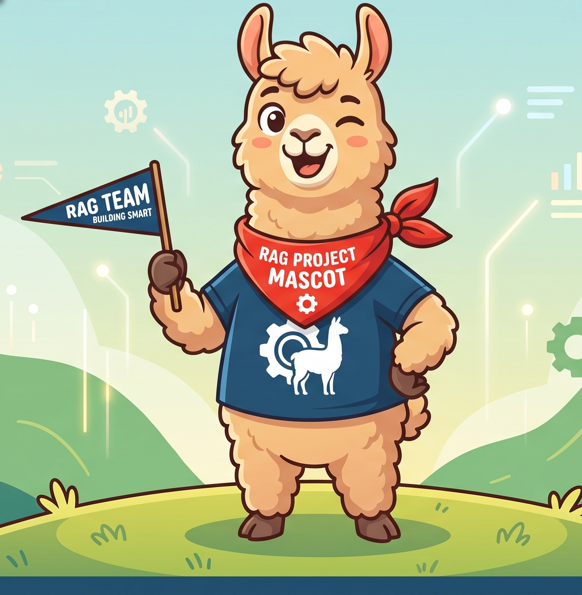

# Web RAG Pipeline 🦙

A highly accurate, lightweight Retrieval-Augmented Generation (RAG) pipeline that performs real-time web and news searches to answer questions. This project specializes in **Semantic Block Isolation** and **Strict Sentence Extraction** to ensure the language model only receives complete, highly relevant facts without HTML noise, SEO spam, or fragmented sentences. 

Why was this project written in 2026? This project exists to make an accurate LLM with 4 GB of VRAM on a 2019 graphics card. Small LLMs are not accurate without RAG techniques and this is one attempt at a local QA pipeline.



## Key Features

* Real-Time Search Integration uses DuckDuckGo (via `ddgs`) to pull the latest web pages and news articles based on query intent.
* Semantic Block Isolation intelligently injects boundaries around block-level HTML tags before text extraction to prevent sidebars and paragraphs from mashing together.
* Aggressive Noise Filtering employs link-density checks and regex signatures to mathematically destroy ad blocks, promo popups, and SEO link-farms before they reach the LLM.
* Strict Sentence Validation sentences are strictly evaluated for capitalization, punctuation, and word count to discard tables, lists of numbers, and incomplete fragments.
* Anaphora Resolution (Pronoun Merging) automatically detects sentences starting with pronouns (He, She, It, etc.) and merges them with the previous sentence to preserve full context for the Extractor LLM.
* 100% Local LLM Processing powered by [Ollama](https://ollama.com/), running locally for maximum privacy and cost-efficiency.

## Prerequisites & Dependencies

To run this pipeline, you will need Python 3.8+ and a local installation of Ollama.

### 1. Install Python Packages
Run the following command to install the required Python libraries:

```bash
pip install beautifulsoup4 ddgs ollama requests

```

### 2. Install and Configure Ollama

This pipeline defaults to using the `qwen2.5:1.5b` model for both parsing/extraction and final generation due to its speed and capability.

1. Download and install **Ollama** from [ollama.com](https://ollama.com/).
2. Pull the required model by running this in your terminal:

```bash
ollama pull qwen2.5:1.5b
```

## Usage

Simply run the main Python script. By default, it will execute a test query at the bottom of the file.

```bash
python web-rag-pipeline.py
**OR**
python web-rag-simple.py
```

Honestly the simple version is way less code and it works surprisingly well. I would almost recommend it over the complicated version. Most of the documentation here concerns the `-pipeline` version

### How it Works Under the Hood

1. Parser-LLM evaluates your query to determine if a web search is needed and extracts optimized keywords.
2. Ingestion & Cleanup scrapes top URLs, destroys boilerplate HTML, and applies density filters.
3. FSM Tagging splits the clean HTML blocks into validated sentences and assigns sequential XML tags (e.g., `<TAG-1>`).
4. Extractor-LLM reviews the tagged blocks and outputs exactly which tags contain facts relevant to the query.
5. Generator-LLM takes the perfectly clean, filtered facts and generates a grounded, hallucination-free final answer.

**Happy Extracting!**
